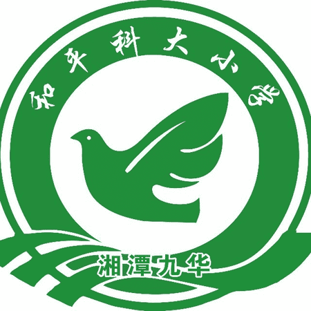

《植物生长记》教材及本网站由以下团队成员共同创作完成。

### 创作团队

::: {.grid}

::: {.g-col-6}
#### 📘 教材撰写
**徐湘粤，周晨曦**
*主编，负责教材整体结构设计与文本编写。（根据姓氏首字母排列）*
:::

::: {.g-col-6}
#### 🎥 视频制作
**[视频作者名字]**
*负责所有教学视频的拍摄与剪辑。*
:::

::: {.g-col-6}
#### 📷 摄影与图像
**黄安峰**
*提供了教材中精美的植物摄影作品。*
:::

::: {.g-col-6}
#### 💻 网站维护
**周晨曦**
*负责本资源库的搭建与更新。*
:::

:::

---

### 🏫 合作院校与支持

本项目由来自以下学术机构的研究人员共同开发：

::: {layout-ncol=2}

::: {.center-text style="text-align: center;"}
{width=140px}

**湘潭市雨湖区九华和平科大小学**
:::

::: {.center-text style="text-align: center;"}
{width=210px}

**The George Washington University**

:::

:::

---
*© 2025 植物生长记项目组. All rights reserved.*